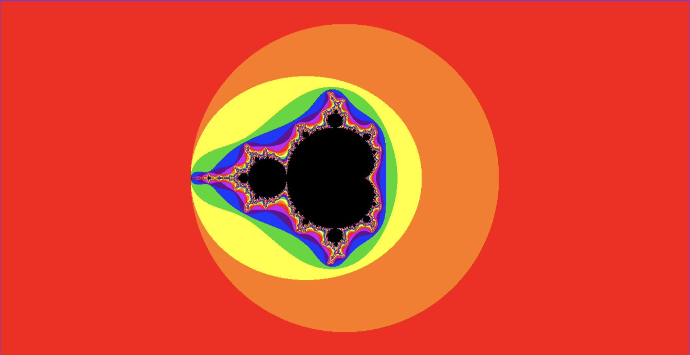

# Hello!
This is my attempt at creating a webpage for viewing the mandelbrot set

Currently: renders the set, allows programmatically changing the zoom and origin

TODO: add UI for changeing zoom/origin, allow interactive movement of the canvas

